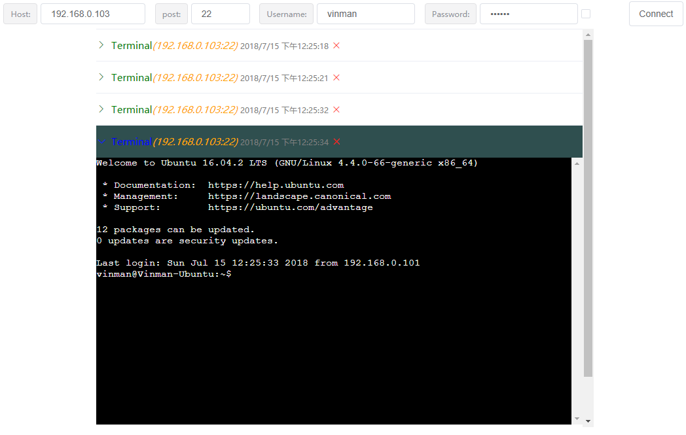
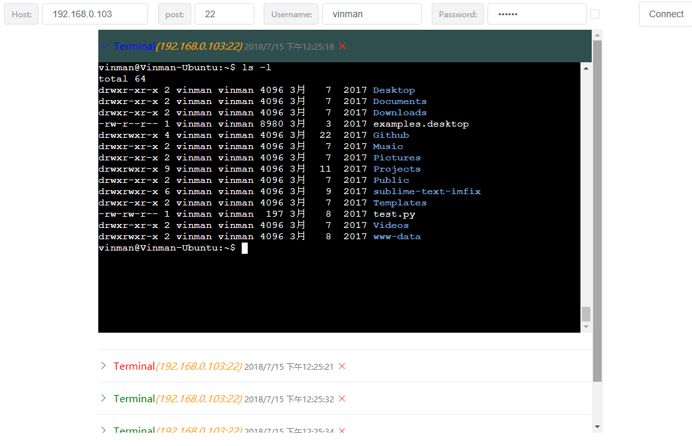
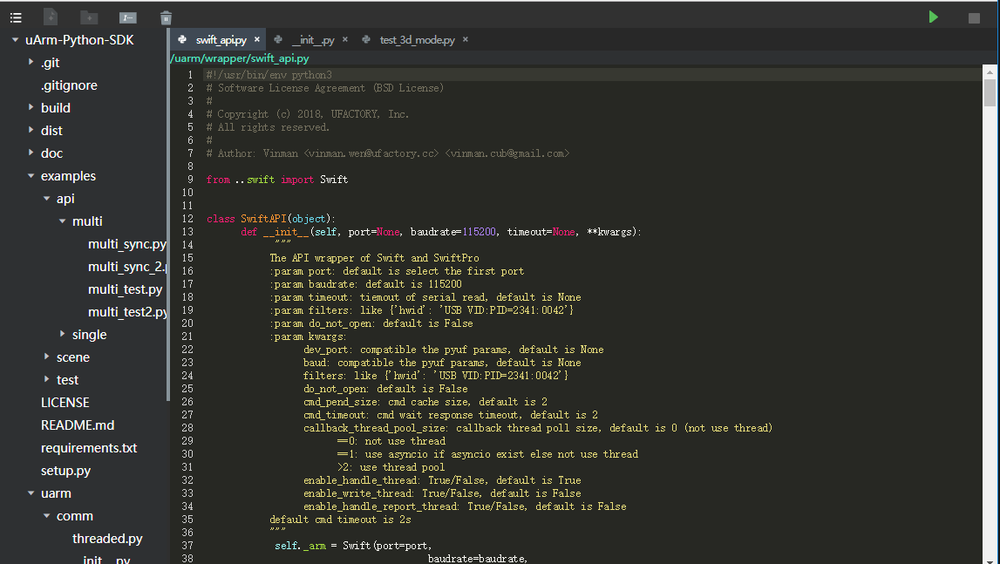
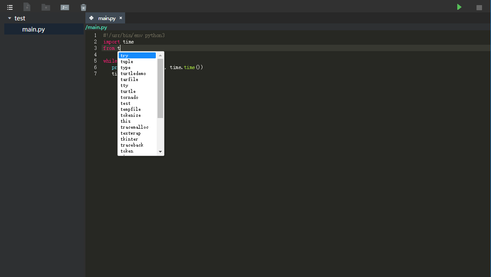
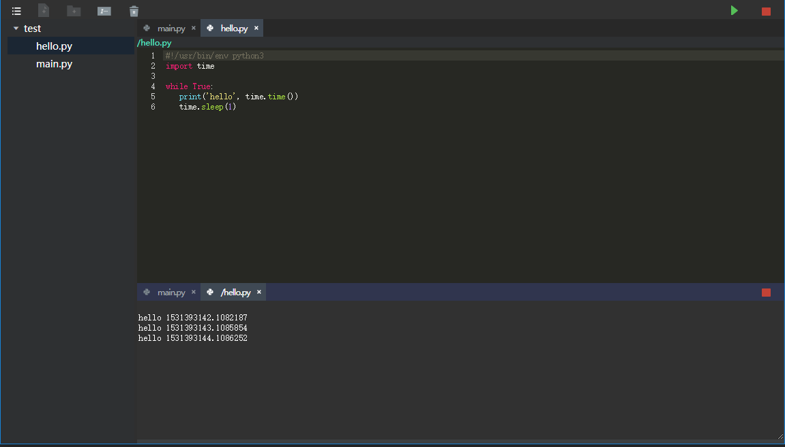

# ToolBox
-----------
> 工具箱

- PythonWebIDE
- WebSSH


## 编译与运行
### 前端
```
#### 安装依赖
npm install 或者 yarn install

#### 开发运行(默认端口是8080)
npm run dev 或者 yarn run dev

#### 打包编译(默认打包的路径已经指定在后端程序可以加载的地方)
npm run build 或者 yarn build
```
### 后端
```
#### 进入backend目录
cd backend

#### 安装依赖
pip install -r requirements.txt

#### 运行（运行端口为10086）指定端口可以使用参数 --port=10010
#### 如果前端页面是独立运行的，不可指定后端端口（除非修改前端代码）
python server.py

####访问 ({path}根据不同的模块不同，如IDE的path是/editor)
开发运行前端的情况: localhost:8080/{path} 
打包好前端的情况: localhost:10086/{path}
```

## WebSSH （path=webssh）
-----------
> 在线的SSH工具
> 前后端分离

### 概述
在线的SSH工具在实现上前后端分离，后端使用Python的Tornado框架实现，前端使用Vue来实现，使用xterm.js实现的终端。

### 技术栈
- Python/Tornado
- JS/Vue

### 功能描述
- 支持同时连接多个ssh服务器，最大限制5个
- 支持折叠和打开某个终端窗口，支持关闭某个终端
- 暂时只支持固定的终端窗口大小





## Python-Web-IDE（path=editor）
-----------
>  一个在线Python的IDE
>  前后端分离

### 概述
在线Python IDE在实现上前后端分离，后端使用Python的Tornado框架实现，前端使用Vue来实现。

### 技术栈
- Python/Tornado
- JS/Vue

### 功能描述
- 支持工程、文件、文件夹的增删查改
- 支持Python代码基本补全
- 支持Python代码运行管理和输出

编码:

补全:

运行:



